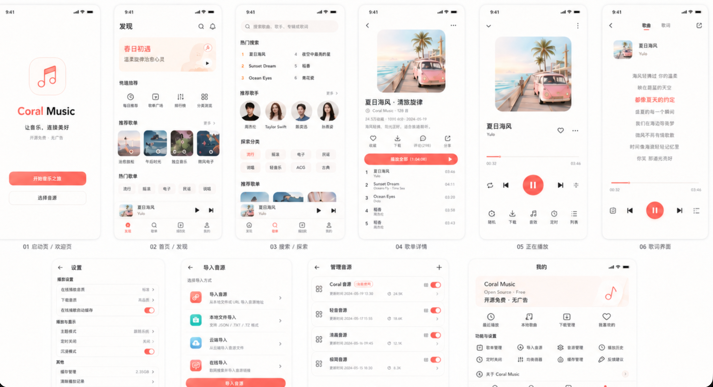

# 珊瑚音乐移动端

基于 Flutter 的珊瑚音乐移动客户端，一套业务代码同时覆盖 **iOS**、**Android** 和 **鸿蒙 (HarmonyOS)** 三个平台。桌面版应用请见 [珊瑚音乐桌面端](https://github.com/vien-meng/coral-music-desktop)。

## 当前状态

> **版本 1.0.0** | 开发阶段 | 2026-07-20

项目已完成九个产品入口的核心功能闭环：五源在线检索（酷我/QQ/网易云/咪咕/酷狗搜索）、完整播放器（音频引擎、取链、歌词、队列、后台播放、进度恢复）、本地 SQLite 持久化（列表/收藏/历史/歌单收藏/专辑收藏）、下载队列、WebDAV 远程媒体、本地音频导入、备份恢复、音源管理与持久化恢复。Android 真机（SM-N986U / Android 13）已完成核心播放闭环验证，iOS 编译通过待真机验收，鸿蒙待调试签名。

## 技术栈

| 类别        | 方案                               |
| ----------- | ---------------------------------- |
| 框架        | Flutter (3.27.5-ohos) / Dart 3.6.2 |
| 状态管理    | Riverpod (`flutter_riverpod`)      |
| 路由        | Go Router (`go_router`)            |
| HTTP 客户端 | Dio                                |
| UI 组件     | Material 3                         |
| 主题        | 珊瑚红种子色，跟随系统明暗模式     |

## 架构

```text
lib/
  app/                  # 启动、主题、路由、应用壳
  core/                 # 基础设施：HTTP 客户端、异常定义
  domain/               # 跨功能领域模型（Track、来源、音质等）
  features/
    leaderboard/        # 排行榜、每日推荐（data/state/view）
    search/             # 歌曲搜索、综合搜索、搜索历史（data/state/view）
    song_list/          # 歌单广场（data/state/view）
    player/             # 播放器、歌词、队列、音源管理（data/state/view）
    library/            # 我的列表、收藏、播放历史、音乐分类（data/state/view）
  platform/             # MethodChannel 平台桥接能力
```

每个功能模块按 `data/`（数据层）、`state/`（状态管理）、`view/`（UI 层）分层。UI 不直接访问 Dio、SQLite 或 MethodChannel。

### 领域模型

- **Track**：统一歌曲实体，支持 `online`、`local`、`download`、`webdav` 四类来源
- **AudioQuality**：master → atmos_plus → atmos → hires → flac24bit → flac → 320k → 192k → 128k 逐级降级
- **PlaybackQueue**：播放队列，支持替换、切歌、context 跟踪
- **OnlineSource**：酷我、酷狗、QQ、网易云、咪咕 五类在线音乐源

### 产品界面

<p></p>

### 产品入口

九个产品入口，与桌面端行为对齐：

| 入口　　 | 优先级 | 状态　　　　　　　　　　　　　　　　　　　　　　　　　                         |
| -------- | ------ | ------------------------------------------------------------------------------ |
| 排行榜　 | P0　　 | 酷我/QQ/咪咕/网易云四源榜单已对接，酷狗 TLS 阻塞；每日推荐已实现               |
| 搜索　　 | P0　　 | 五源搜索（酷我/QQ/网易云/咪咕/酷狗）+ 综合搜索 + 搜索历史 + 热搜词             |
| 歌单广场 | P0　　 | 酷我/咪咕歌单广场、标签、排序、搜索、滚动加载已完成　                          |
| 我的列表 | P0　　 | SQLite CRUD、批量操作、导入导出、重复检测、本地音频导入、CUE 分轨              |
| 我的收藏 | P1　　 | 歌曲收藏、歌单收藏快照、专辑收藏快照已完成　　　　　                           |
| 音乐分类 | P1　　 | 播放历史、艺术家/专辑/类型/年份五分类已完成　　　　　                          |
| 下载　　 | P1　　 | 在线下载队列、歌单下载、音质升级、文件导出已完成　　                           |
| 网盘资源 | P1　　 | WebDAV 浏览/搜索/下载/多账号/面包屑/加入列表已完成　                           |
| 设置　　 | P1　　 | 音源管理、主题模式、定时停止、缓存管理、默认音质、不感兴趣规则、备份恢复已完成 |

- 当前进度见[开发日志](CHANGELOG.md)

## 开发环境

### 前置要求

- Flutter 3.27.5+ (鸿蒙使用 OpenHarmony Flutter 发行版)
- Dart 3.6.2+
- Android：API 35、Build Tools、NDK 26.1
- iOS：Xcode 26.6+、CocoaPods 1.17.0+
- 鸿蒙：OpenHarmony API 18、Ohpm 5.1.3、Hvigor 5.18.6、DevEco Studio

### 快速开始

```bash
# 安装依赖
flutter pub get

# 代码格式化
dart format --output=none --set-exit-if-changed .

# 静态分析
flutter analyze

# 运行单测
flutter test

# 构建
flutter build hap --debug          # 鸿蒙
flutter build apk --debug          # Android
flutter build ios --debug --no-codesign  # iOS
```

## 开发工作流

1. 核对桌面端当前实现，确认为基线
2. 读取 [功能对等矩阵](skills/coral-music-mobile/references/feature-parity.md) 确认优先级与验收场景
3. 读取 [架构文档](skills/coral-music-mobile/references/architecture.md) 沿既定分层实现
4. 读取 [开发计划](skills/coral-music-mobile/references/development-plan.md) 领取任务并更新状态
5. 实现纵向可运行切片，先贯穿 UI、状态、数据再到平台能力
6. 每个非平凡行为至少包含一个可运行检查
7. 完成时回写任务历史和计划文档
8. 构建时，请关注是否需要补充的一些依赖，一般情况下flutter会自动补充

完整开发文档位于 `skills/coral-music-mobile/` 目录。

## 鸿蒙系统构建

- 详见[鸿蒙系统构建说明](skills/coral-music-mobile/references/ohos-build-and-device-debugging.md)

## 不变量

- 九个产品入口行为与桌面端对等
- 默认进入排行榜；"播放全部"替换队列并播放当前页第一首
- 在线、本地、已下载、WebDAV 四种独立来源；本地和 WebDAV 不进入在线取链
- 保持 LX User API 协议兼容，动态脚本运行在受限沙箱
- 同目录本地歌词优先于在线歌词
- 账号密码、Token 和密钥只进入系统安全存储
- 共享 Dart 层不依赖平台 SDK，仅桥接层调用系统 API
- 三端同步验收

## 验证命令

```bash
dart format --output=none --set-exit-if-changed .
flutter analyze
flutter test
flutter build hap --debug
flutter build apk --debug
flutter build ios --debug --no-codesign
```

## 项目依赖

核心依赖：

- `flutter_riverpod` - 响应式状态管理
- `go_router` - 声明式路由
- `dio` - HTTP 网络请求
- `just_audio` / `just_audio_harmonyos` - 三端音频引擎
- `audio_service` - 后台播放与系统媒体服务
- `flutter_sqflite` - 三端 SQLite 持久化
- `flutter_secure_storage` - 安全凭据存储
- `path_provider` - 应用目录访问
- `file_picker` - 文件选择与导出
- `crypto` - 加解密支持
- `pointycastle` - 加密算法库

开发依赖：

- `flutter_test` - 单元测试
- `flutter_lints` - 代码规范检查

## 版权声明

Copyright (c) 2025-present 珊瑚音乐 (Coral Music) 及其贡献者。保留所有权利。

本项目基于 [MIT License](LICENSE) 开源。

### 免责声明

- 本应用仅提供音乐播放与本地管理能力，**不内置任何版权音乐资源**，亦不提供资源分享、分发或下载链接服务。
- 在线歌曲需要用户在音源管理中自行导入并启用兼容的第三方来源；开发者不对用户使用该功能所访问的内容承担任何责任。
- 用户应遵守中华人民共和国相关法律法规及音乐内容版权方规定，**仅播放和下载已获得合法授权的音乐内容**。
- 本应用不得用于任何形式的商业盈利活动，包括但不限于付费分发、内置广告、捆绑推广等。
- 开发者保留随时更新本免责声明的权利，恕不另行通知。

### 第三方依赖

本项目使用以下开源项目，对应许可证详见各项目的源仓库：

| 依赖　　　　　　　　　  | 许可证　　　  | 用途　　　　　　　  |
| ----------------------- | ------------- | ------------------- |
| Flutter　　　　　　　　 | BSD-3-Clause  | 跨平台 UI 框架　　  |
| flutter_riverpod　　　  | MIT　　　　　 | 状态管理　　　　　  |
| go_router　　　　　　　 | BSD-3-Clause  | 路由管理　　　　　  |
| Dio　　　　　　　　　　 | MIT　　　　　 | HTTP 网络请求　　　 |
| just_audio　　　　　　  | BSD-3-Clause  | 音频播放引擎　　　  |
| audio_service　　　　　 | MIT　　　　　 | 后台播放与媒体服务  |
| flutter_sqflite　　　　 | BSD-3-Clause  | SQLite 持久化　　　 |
| flutter_secure_storage  | BSD-3-Clause  | 安全凭据存储　　　  |
| path_provider　　　　　 | BSD-3-Clause  | 应用目录访问　　　  |
| file_picker　　　　　　 | MIT　　　　　 | 文件选择与导出　　  |
| crypto　　　　　　　　  | BSD-3-Clause  | 加解密支持　　　　  |
| pointycastle　　　　　  | MIT　　　　　 | 加密算法库　　　　  |

### 贡献许可

除非另有明确声明，任何有意提交以纳入本项目的贡献均默认以 MIT 许可证授权，不附加额外条款。
